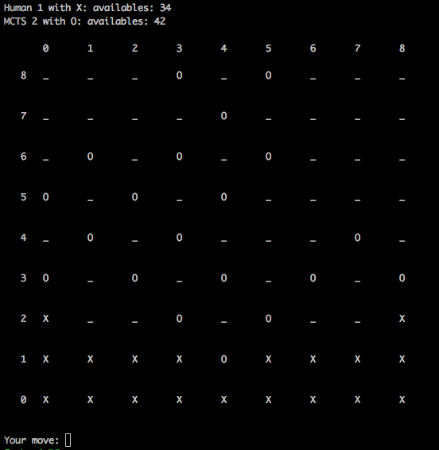
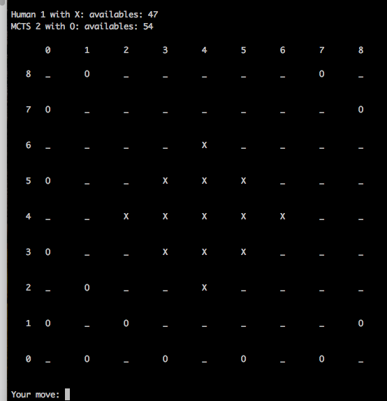
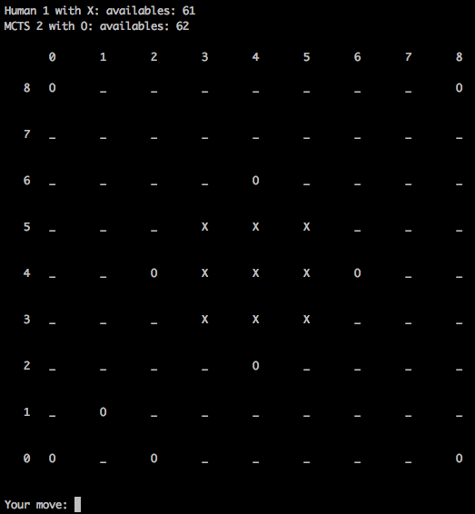

# AlphaNoGo
Using ideas from AlphaGo Zero to apply to the NoGo game

## NoGo rules
1. board size 9x9
2. black go first, and then alternate turns
3. The goal is NOT to surround and take the stones occupied by the other player. Contrary, this will yield failure.
4. 'PASS' or 'SUICIDE' is also treated as failure.
5. There will always be one winner, no 'draw'

## Training
`python3 train.py`

## Play with it
1. copy best_policy.model* from under checkpoint to root
2. run below
`python3 human_play.py`

## Results
1. After about 500 games of self play, AI learned to make eyes.

2. After about 1000 games, AI learn to make eyes first close to corner is more efficient.

3. After about 1500 games, AI find the best efficient starting point to be eact corner, and has learned to prevent human from making eyes.

 