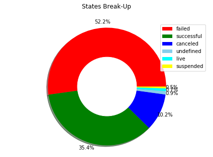
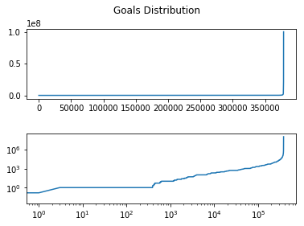
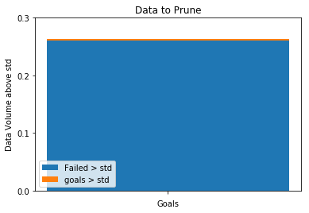

# Analysing the Data!


```python
import pandas as pd
import numpy as np
import matplotlib.pyplot as plt
from scipy import stats

df = pd.read_csv('KS.csv')
df.head()
```


<div>
<style scoped>
    .dataframe tbody tr th:only-of-type {
        vertical-align: middle;
    }

    .dataframe tbody tr th {
        vertical-align: top;
    }

    .dataframe thead th {
        text-align: right;
    }
</style>
<table border="1" class="dataframe">
  <thead>
    <tr style="text-align: right;">
      <th></th>
      <th>ID</th>
      <th>name</th>
      <th>category</th>
      <th>main_category</th>
      <th>currency</th>
      <th>deadline</th>
      <th>goal</th>
      <th>launched</th>
      <th>pledged</th>
      <th>state</th>
      <th>backers</th>
      <th>country</th>
      <th>usd pledged</th>
      <th>usd_pledged_real</th>
      <th>usd_goal_real</th>
    </tr>
  </thead>
  <tbody>
    <tr>
      <th>0</th>
      <td>1000002330</td>
      <td>The Songs of Adelaide &amp; Abullah</td>
      <td>Poetry</td>
      <td>Publishing</td>
      <td>GBP</td>
      <td>2015-10-09</td>
      <td>1000.0</td>
      <td>2015-08-11 12:12:28</td>
      <td>0.0</td>
      <td>failed</td>
      <td>0</td>
      <td>GB</td>
      <td>0.0</td>
      <td>0.0</td>
      <td>1533.95</td>
    </tr>
    <tr>
      <th>1</th>
      <td>1000003930</td>
      <td>Greeting From Earth: ZGAC Arts Capsule For ET</td>
      <td>Narrative Film</td>
      <td>Film &amp; Video</td>
      <td>USD</td>
      <td>2017-11-01</td>
      <td>30000.0</td>
      <td>2017-09-02 04:43:57</td>
      <td>2421.0</td>
      <td>failed</td>
      <td>15</td>
      <td>US</td>
      <td>100.0</td>
      <td>2421.0</td>
      <td>30000.00</td>
    </tr>
    <tr>
      <th>2</th>
      <td>1000004038</td>
      <td>Where is Hank?</td>
      <td>Narrative Film</td>
      <td>Film &amp; Video</td>
      <td>USD</td>
      <td>2013-02-26</td>
      <td>45000.0</td>
      <td>2013-01-12 00:20:50</td>
      <td>220.0</td>
      <td>failed</td>
      <td>3</td>
      <td>US</td>
      <td>220.0</td>
      <td>220.0</td>
      <td>45000.00</td>
    </tr>
    <tr>
      <th>3</th>
      <td>1000007540</td>
      <td>ToshiCapital Rekordz Needs Help to Complete Album</td>
      <td>Music</td>
      <td>Music</td>
      <td>USD</td>
      <td>2012-04-16</td>
      <td>5000.0</td>
      <td>2012-03-17 03:24:11</td>
      <td>1.0</td>
      <td>failed</td>
      <td>1</td>
      <td>US</td>
      <td>1.0</td>
      <td>1.0</td>
      <td>5000.00</td>
    </tr>
    <tr>
      <th>4</th>
      <td>1000011046</td>
      <td>Community Film Project: The Art of Neighborhoo...</td>
      <td>Film &amp; Video</td>
      <td>Film &amp; Video</td>
      <td>USD</td>
      <td>2015-08-29</td>
      <td>19500.0</td>
      <td>2015-07-04 08:35:03</td>
      <td>1283.0</td>
      <td>canceled</td>
      <td>14</td>
      <td>US</td>
      <td>1283.0</td>
      <td>1283.0</td>
      <td>19500.00</td>
    </tr>
  </tbody>
</table>
</div>


```python
percent_missing = (df.isnull().sum() * 100 / len(df)).round(2)
missing_value_df = pd.DataFrame({'percent_missing': percent_missing})
missing_value_df.sort_values('percent_missing', ascending=False, inplace=True)
missing_value_df
```


<div>
<style scoped>
    .dataframe tbody tr th:only-of-type {
        vertical-align: middle;
    }

    .dataframe tbody tr th {
        vertical-align: top;
    }

    .dataframe thead th {
        text-align: right;
    }
</style>
<table border="1" class="dataframe">
  <thead>
    <tr style="text-align: right;">
      <th></th>
      <th>percent_missing</th>
    </tr>
  </thead>
  <tbody>
    <tr>
      <th>usd pledged</th>
      <td>1.0</td>
    </tr>
    <tr>
      <th>ID</th>
      <td>0.0</td>
    </tr>
    <tr>
      <th>name</th>
      <td>0.0</td>
    </tr>
    <tr>
      <th>category</th>
      <td>0.0</td>
    </tr>
    <tr>
      <th>main_category</th>
      <td>0.0</td>
    </tr>
    <tr>
      <th>currency</th>
      <td>0.0</td>
    </tr>
    <tr>
      <th>deadline</th>
      <td>0.0</td>
    </tr>
    <tr>
      <th>goal</th>
      <td>0.0</td>
    </tr>
    <tr>
      <th>launched</th>
      <td>0.0</td>
    </tr>
    <tr>
      <th>pledged</th>
      <td>0.0</td>
    </tr>
    <tr>
      <th>state</th>
      <td>0.0</td>
    </tr>
    <tr>
      <th>backers</th>
      <td>0.0</td>
    </tr>
    <tr>
      <th>country</th>
      <td>0.0</td>
    </tr>
    <tr>
      <th>usd_pledged_real</th>
      <td>0.0</td>
    </tr>
    <tr>
      <th>usd_goal_real</th>
      <td>0.0</td>
    </tr>
  </tbody>
</table>
</div>


```python
df[df['usd pledged'].isnull()].head()
```


<div>
<style scoped>
    .dataframe tbody tr th:only-of-type {
        vertical-align: middle;
    }

    .dataframe tbody tr th {
        vertical-align: top;
    }

    .dataframe thead th {
        text-align: right;
    }
</style>
<table border="1" class="dataframe">
  <thead>
    <tr style="text-align: right;">
      <th></th>
      <th>ID</th>
      <th>name</th>
      <th>category</th>
      <th>main_category</th>
      <th>currency</th>
      <th>deadline</th>
      <th>goal</th>
      <th>launched</th>
      <th>pledged</th>
      <th>state</th>
      <th>backers</th>
      <th>country</th>
      <th>usd pledged</th>
      <th>usd_pledged_real</th>
      <th>usd_goal_real</th>
    </tr>
  </thead>
  <tbody>
    <tr>
      <th>169</th>
      <td>1000694855</td>
      <td>STREETFIGHTERZ WHEELIE MURICA</td>
      <td>Film &amp; Video</td>
      <td>Film &amp; Video</td>
      <td>USD</td>
      <td>2014-09-20</td>
      <td>6500.0</td>
      <td>2014-08-06 21:28:36</td>
      <td>555.00</td>
      <td>undefined</td>
      <td>0</td>
      <td>N,0"</td>
      <td>NaN</td>
      <td>555.00</td>
      <td>6500.00</td>
    </tr>
    <tr>
      <th>328</th>
      <td>100149523</td>
      <td>Duncan Woods - Chameleon EP</td>
      <td>Music</td>
      <td>Music</td>
      <td>AUD</td>
      <td>2015-08-25</td>
      <td>4500.0</td>
      <td>2015-08-04 12:05:17</td>
      <td>4767.00</td>
      <td>undefined</td>
      <td>0</td>
      <td>N,0"</td>
      <td>NaN</td>
      <td>3402.08</td>
      <td>3211.53</td>
    </tr>
    <tr>
      <th>632</th>
      <td>1003023003</td>
      <td>The Making of Ashley Kelley's Debut Album</td>
      <td>Music</td>
      <td>Music</td>
      <td>USD</td>
      <td>2015-04-09</td>
      <td>3500.0</td>
      <td>2015-03-10 20:06:13</td>
      <td>3576.00</td>
      <td>undefined</td>
      <td>0</td>
      <td>N,0"</td>
      <td>NaN</td>
      <td>3576.00</td>
      <td>3500.00</td>
    </tr>
    <tr>
      <th>647</th>
      <td>1003130892</td>
      <td>Butter Side Down Debut Album</td>
      <td>Music</td>
      <td>Music</td>
      <td>USD</td>
      <td>2015-11-26</td>
      <td>6000.0</td>
      <td>2015-11-02 22:09:19</td>
      <td>7007.80</td>
      <td>undefined</td>
      <td>0</td>
      <td>N,0"</td>
      <td>NaN</td>
      <td>7007.80</td>
      <td>6000.00</td>
    </tr>
    <tr>
      <th>749</th>
      <td>1003629045</td>
      <td>Chase Goehring debut EP</td>
      <td>Music</td>
      <td>Music</td>
      <td>USD</td>
      <td>2016-03-21</td>
      <td>3000.0</td>
      <td>2016-02-23 03:09:49</td>
      <td>3660.38</td>
      <td>undefined</td>
      <td>0</td>
      <td>N,0"</td>
      <td>NaN</td>
      <td>3660.38</td>
      <td>3000.00</td>
    </tr>
  </tbody>
</table>
</div>


Since we are just classifying variables to predict success or failure, we can ignore the missing pledge, as we will be dropping it.


```python
df.nunique()
```


    ID                  378661
    name                375764
    category               159
    main_category           15
    currency                14
    deadline              3164
    goal                  8353
    launched            378089
    pledged              62130
    state                    6
    backers               3963
    country                 23
    usd pledged          95455
    usd_pledged_real    106065
    usd_goal_real        50339
    dtype: int64


Based on the uniqe values observed in the dataframe, we further explore the state variable to study its distribution.


```python
states = df["state"].value_counts() / len(df["state"]) * 100
names = states.index
size = states.values
pie_chart = plt.Circle((0,0), 0.5, color = 'white')
fig1, ax1 = plt.subplots()
plt.pie(size, autopct='%1.1f%%',
        shadow=True, startangle=0,pctdistance=1.1, colors = ['red','green','blue','skyblue','cyan','yellow'])
p=plt.gcf()
p.gca().add_artist(pie_chart)
ax1.legend(labels=names)
ax1.axis('equal')
plt.tight_layout()
plt.title('States Break-Up', y=1.08)
plt.show()
```





```python
df = df[df['state'].isin(['successful', 'failed'])]
df.goal.describe()
```


    count    3.316750e+05
    mean     4.425157e+04
    std      1.117917e+06
    min      1.000000e-02
    25%      2.000000e+03
    50%      5.000000e+03
    75%      1.500000e+04
    max      1.000000e+08
    Name: goal, dtype: float64


```python
f, (ax1, ax2) = plt.subplots(nrows=2, ncols=1)
x = df.goal.index
y = np.sort(df.goal.values)
ax1.plot(x, y)
ax2.loglog(x, y)
f.subplots_adjust(hspace=0.5)
f.suptitle("Goals Distribution")
plt.show()
print('shape of data before filtering',df.shape)
```





    ('shape of data before filtering', (331675, 15))


Here we observe a sudden growth in the goal beyond 10^6 shooting up exponentially. We need to further check the details of goals above standard deviation as there can possibly be high volume of unrealistic goals.


```python
before = df.shape[0]
print('shape of data before filtering',before)
t_df = df[df.goal >= df['goal'].std()]
after_goal = t_df.shape[0]
print('shape of data after filtering for goals beyond $1117916.69',after_goal)
t_df = t_df[t_df.state != 'successful']
after_state = t_df.shape[0]
print('shape of data after filtering out all success',after_state)
t_df.head()
```

    ('shape of data before filtering', 331675)
    ('shape of data after filtering for goals beyond $1117916.69', 874)
    ('shape of data after filtering out all success', 862)


<div>
<style scoped>
    .dataframe tbody tr th:only-of-type {
        vertical-align: middle;
    }

    .dataframe tbody tr th {
        vertical-align: top;
    }

    .dataframe thead th {
        text-align: right;
    }
</style>
<table border="1" class="dataframe">
  <thead>
    <tr style="text-align: right;">
      <th></th>
      <th>ID</th>
      <th>name</th>
      <th>category</th>
      <th>main_category</th>
      <th>currency</th>
      <th>deadline</th>
      <th>goal</th>
      <th>launched</th>
      <th>pledged</th>
      <th>state</th>
      <th>backers</th>
      <th>country</th>
      <th>usd pledged</th>
      <th>usd_pledged_real</th>
      <th>usd_goal_real</th>
    </tr>
  </thead>
  <tbody>
    <tr>
      <th>528</th>
      <td>1002538085</td>
      <td>Green Lizzie: The only container truly adapted...</td>
      <td>Product Design</td>
      <td>Design</td>
      <td>SEK</td>
      <td>2017-03-25</td>
      <td>1700000.0</td>
      <td>2017-02-24 09:06:26</td>
      <td>40835.0</td>
      <td>failed</td>
      <td>34</td>
      <td>SE</td>
      <td>761.14</td>
      <td>4579.92</td>
      <td>190666.32</td>
    </tr>
    <tr>
      <th>971</th>
      <td>1004941506</td>
      <td>Maori MBT Awareness Centre</td>
      <td>Web</td>
      <td>Journalism</td>
      <td>CAD</td>
      <td>2017-10-18</td>
      <td>2000000.0</td>
      <td>2017-08-19 22:13:55</td>
      <td>2242.0</td>
      <td>failed</td>
      <td>19</td>
      <td>CA</td>
      <td>1160.67</td>
      <td>1794.46</td>
      <td>1600768.37</td>
    </tr>
    <tr>
      <th>1042</th>
      <td>1005237669</td>
      <td>The Old Soul of a Lion</td>
      <td>Film &amp; Video</td>
      <td>Film &amp; Video</td>
      <td>USD</td>
      <td>2014-10-14</td>
      <td>3000000.0</td>
      <td>2014-08-15 20:16:22</td>
      <td>4.0</td>
      <td>failed</td>
      <td>2</td>
      <td>US</td>
      <td>4.00</td>
      <td>4.00</td>
      <td>3000000.00</td>
    </tr>
    <tr>
      <th>1415</th>
      <td>1007217653</td>
      <td>QUIUBO</td>
      <td>Sound</td>
      <td>Technology</td>
      <td>MXN</td>
      <td>2017-11-13</td>
      <td>2400000.0</td>
      <td>2017-10-01 19:39:35</td>
      <td>27296.0</td>
      <td>failed</td>
      <td>24</td>
      <td>MX</td>
      <td>442.58</td>
      <td>1433.46</td>
      <td>126037.18</td>
    </tr>
    <tr>
      <th>1795</th>
      <td>1009207145</td>
      <td>** GOLIATH **</td>
      <td>Product Design</td>
      <td>Design</td>
      <td>CAD</td>
      <td>2014-07-21</td>
      <td>3850000.0</td>
      <td>2014-06-21 22:34:21</td>
      <td>285.0</td>
      <td>failed</td>
      <td>5</td>
      <td>CA</td>
      <td>263.41</td>
      <td>264.67</td>
      <td>3575408.62</td>
    </tr>
  </tbody>
</table>
</div>


```python
total = 100.0
# todo print actual percentage and remove log10
after_state_bar = (after_state * total/before)
after_goal_bar = (after_goal * total/before)
p0 = plt.bar([0], after_state_bar)
p1 = plt.bar([0], after_goal_bar-after_state_bar,bottom=after_state_bar)
total = after_goal_bar
#p2 = plt.bar([0], total, bottom=after_goal_bar-after_state_bar)

plt.title('Data to Prune')
plt.ylabel('Data Volume above std')
plt.xlabel('Goals')
plt.xticks([0], (''))
plt.yticks(np.arange(0, total+0.1, 0.1))
plt.legend((p0[0], p1[0]), ('Failed > std', 'goals > std'))
plt.show()
print((after_state_bar/after_goal_bar)*100.0)
print(after_state_bar, after_goal_bar)
```





    98.6270022883
    (0.25989296751337904, 0.26351096706112914)


As we observe with the stacked bar chart, about 98.62% of all goals which are above $1117916.69 failed.
This gives us a good opportunity to further explore this 0.259% data from the data set for pruning to run our classification algorithm.


```python
t_df = df[(df['goal'] <= df['goal'].std()) | ((df['goal'] >= df['goal'].std()) & (df['state'] == 1)) ].copy()
print(t_df.shape[0])
t_df.head()
```

    330801


<div>
<style scoped>
    .dataframe tbody tr th:only-of-type {
        vertical-align: middle;
    }

    .dataframe tbody tr th {
        vertical-align: top;
    }

    .dataframe thead th {
        text-align: right;
    }
</style>
<table border="1" class="dataframe">
  <thead>
    <tr style="text-align: right;">
      <th></th>
      <th>ID</th>
      <th>name</th>
      <th>category</th>
      <th>main_category</th>
      <th>currency</th>
      <th>deadline</th>
      <th>goal</th>
      <th>launched</th>
      <th>pledged</th>
      <th>state</th>
      <th>backers</th>
      <th>country</th>
      <th>usd pledged</th>
      <th>usd_pledged_real</th>
      <th>usd_goal_real</th>
    </tr>
  </thead>
  <tbody>
    <tr>
      <th>0</th>
      <td>1000002330</td>
      <td>The Songs of Adelaide &amp; Abullah</td>
      <td>Poetry</td>
      <td>Publishing</td>
      <td>GBP</td>
      <td>2015-10-09</td>
      <td>1000.0</td>
      <td>2015-08-11 12:12:28</td>
      <td>0.0</td>
      <td>failed</td>
      <td>0</td>
      <td>GB</td>
      <td>0.0</td>
      <td>0.0</td>
      <td>1533.95</td>
    </tr>
    <tr>
      <th>1</th>
      <td>1000003930</td>
      <td>Greeting From Earth: ZGAC Arts Capsule For ET</td>
      <td>Narrative Film</td>
      <td>Film &amp; Video</td>
      <td>USD</td>
      <td>2017-11-01</td>
      <td>30000.0</td>
      <td>2017-09-02 04:43:57</td>
      <td>2421.0</td>
      <td>failed</td>
      <td>15</td>
      <td>US</td>
      <td>100.0</td>
      <td>2421.0</td>
      <td>30000.00</td>
    </tr>
    <tr>
      <th>2</th>
      <td>1000004038</td>
      <td>Where is Hank?</td>
      <td>Narrative Film</td>
      <td>Film &amp; Video</td>
      <td>USD</td>
      <td>2013-02-26</td>
      <td>45000.0</td>
      <td>2013-01-12 00:20:50</td>
      <td>220.0</td>
      <td>failed</td>
      <td>3</td>
      <td>US</td>
      <td>220.0</td>
      <td>220.0</td>
      <td>45000.00</td>
    </tr>
    <tr>
      <th>3</th>
      <td>1000007540</td>
      <td>ToshiCapital Rekordz Needs Help to Complete Album</td>
      <td>Music</td>
      <td>Music</td>
      <td>USD</td>
      <td>2012-04-16</td>
      <td>5000.0</td>
      <td>2012-03-17 03:24:11</td>
      <td>1.0</td>
      <td>failed</td>
      <td>1</td>
      <td>US</td>
      <td>1.0</td>
      <td>1.0</td>
      <td>5000.00</td>
    </tr>
    <tr>
      <th>5</th>
      <td>1000014025</td>
      <td>Monarch Espresso Bar</td>
      <td>Restaurants</td>
      <td>Food</td>
      <td>USD</td>
      <td>2016-04-01</td>
      <td>50000.0</td>
      <td>2016-02-26 13:38:27</td>
      <td>52375.0</td>
      <td>successful</td>
      <td>224</td>
      <td>US</td>
      <td>52375.0</td>
      <td>52375.0</td>
      <td>50000.00</td>
    </tr>
  </tbody>
</table>
</div>


Here we take all value under $1117916.69 and only the values whcich were successful above $1117916.69, would make the data suboptimal according to our assumtions.


```python
y = df['goal']
mean = y.mean()
std = y.std()
count = 0
for yi in y:
    zs = (yi-mean)/std
    if zs>1:
        count += 1
        #print(zs)
print(count)
```

    870


We apply Two-Sided Grubb's Test to remove Outliers


```python
#t_test = stats.ttest_1samp(t_df['goal'],df['goal'].mean())
import math
a = 0.05
N = before
p = 1-(a/(2*N))
nn = N-2
value = stats.t.ppf(p, nn)
print(value)
value**=2
print(value)
thresh = math.sqrt(value/(nn*value)) * (N-1)/math.sqrt(N)
print(thresh)
y = df['goal']

term_factor_max = 0
term_factor_min = 0
mean = y.mean()
std = y.std()
mean_dev = abs(y-mean)
for i in range(N):

    y_max = mean_dev.idxmax()
    y_min = mean_dev.idxmin()
    if y_max == term_factor_max and y_min == term_factor_min:
        break
    term_factor_max = y_max
    term_factor_min = y_min
    G1 = abs(mean_dev[y_min])/std
    G2 = abs(mean_dev[y_max])/std
    if G1>thresh:
        mean_dev = mean_dev[mean_dev != mean_dev[y_min]]
        y = y[y != y[y_min]]
    if G2>thresh:
        mean_dev = mean_dev[mean_dev != mean_dev[y_max]]
        y = y[y != y[y_max]]
    #print(i, thresh, G1, y_min, G2, y_max)
p = stats.t.cdf(value, nn)
print(p)
```

    5.2517542379978615
    27.580922576328497
    1.0
    1.0


```python
print('Detected Outliers',N-y.shape[0])
print(y.shape[0])
```

    ('Detected Outliers', 870)
    330805


Looking into the duration of goals:


```python
df['launched'] = pd.to_datetime(df['launched'])
df['deadline'] = pd.to_datetime(df['deadline'])
df['duration'] = df['deadline'].subtract(df['launched'])
df['duration'] = df['duration'].astype('timedelta64[D]')
df = df.drop('launched', 1)
df = df.drop('deadline', 1)
df.duration.describe()
```


    count    331675.000000
    mean         32.954902
    std          12.713329
    min           0.000000
    25%          29.000000
    50%          29.000000
    75%          35.000000
    max          91.000000
    Name: duration, dtype: float64


```python
z = df['duration']
meanz = z.mean()
stdz = z.std()
term_factor_max = 0
term_factor_min = 0
for i in range(N):
    z_max = z.idxmax()
    z_min = z.idxmin()
    if z_max == term_factor_max and z_min == term_factor_min:
        break
    term_factor_max = z_max
    term_factor_min = z_min
    G1 = abs(z[z_min]-mean)/std
    G2 = abs(z[z_max]-mean)/std
    if G1>thresh:
        z = z[z != z[z_min]]
    if G2>thresh:
        z = z[z != z[z_max]]
    #print(i, thresh, G1, z_min, G2, z_max)
p = stats.t.cdf(value, nn)
print(p)
```

    1.0


```python
print('Detected Outliers',N-z.shape[0])
```

    ('Detected Outliers', 0)


We observe no outliers in duration of the goals.


```python
yy = df['goal']
std = yy.std()
yy = yy[yy <= std]
yy.head()
N-yy.shape[0]
```


    874


Comparing the values of goals against standard deviation we get a similar result of that with Grubbs' Test 874 vs 870


```python
count = 0
for yi in y:
    zs = (yi-mean)/std
    if zs>1:
        count += 1
        print(zs)
print(count)
```

    0


Finally re-verifying it with Z-Score
